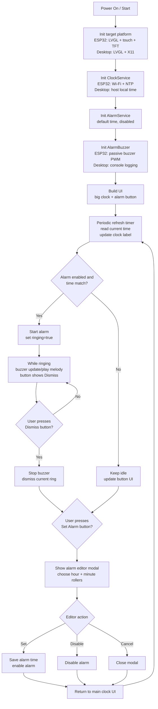

```mermaid
flowchart TD
    A[Power On / Start] --> B[Init target platform<br/>ESP32: LVGL + touch + TFT<br/>Desktop: LVGL + X11]
    B --> C[Init ClockService<br/>ESP32: Wi-Fi + NTP<br/>Desktop: host local time]
    C --> D[Init AlarmService<br/>default time, disabled]
    D --> E[Init AlarmBuzzer<br/>ESP32: passive buzzer PWM<br/>Desktop: console logging]
    E --> F[Build UI<br/>big clock + alarm button]
    F --> G[Periodic refresh timer<br/>read current time<br/>update clock label]
    G --> H{Alarm enabled and<br/>time match?}
    H -- Yes --> I[Start alarm<br/>set ringing=true]
    H -- No --> J[Keep idle<br/>update button UI]
    I --> K[While ringing<br/>buzzer update/play melody<br/>button shows Dismiss]
    K --> L{User presses<br/>Dismiss button?}
    L -- Yes --> M[Stop buzzer<br/>dismiss current ring]
    L -- No --> K
    M --> N{User presses<br/>Set Alarm button?}
    J --> N
    N --> O[Show alarm editor modal<br/>choose hour + minute rollers]
    O --> P{Editor action}
    P -- Set --> Q[Save alarm time<br/>enable alarm]
    P -- Disable --> R[Disable alarm]
    P -- Cancel --> S[Close modal]
    Q --> T[Return to main clock UI]
    R --> T
    S --> T
    T --> G
```
